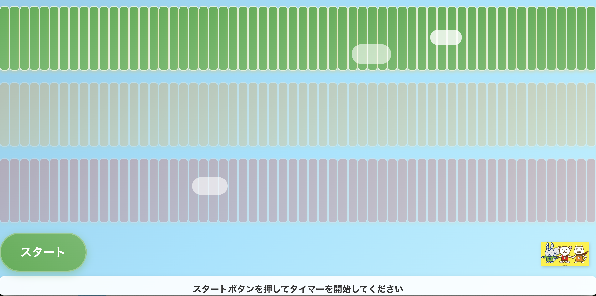

# 3分タイマー - 子供向け (3-Minute Timer for Kids)



子供が時間の経過を視覚的に理解できるように設計された、シンプルな3分タイマーです。

## ✨ 特徴

-   **🕒 3分タイマー**: スタートボタンを押すだけで、3分間のカウントダウンが始まります。
-   **ブロック表示**: 180個のブロックが1秒ごとに1つずつ消えていくことで、残り時間を直感的に把握できます。
-   **色の変化**: 1分ごとにブロックの色が変わり、時間の経過を知らせます（緑 → オレンジ → 赤）。
-   **🎉 完了アニメーション**: タイマーが完了すると、お祝いのアニメーションと効果音でお知らせします。
-   **📱 レスポンシブデザイン**: スマートフォン、タブレット、デスクトップなど、さまざまなデバイスで利用できます。
-   **⌨️ キーボード操作**: スペースキーでタイマーの開始/リセットが可能です。

## 🚀 使い方

1.  下のリンクからデモページにアクセスします。
2.  「スタート」ボタンをクリック（またはスペースキーを押す）して、タイマーを開始します。
3.  ブロックが消えていく様子を眺めながら、時間の経過を体感してください。

[🔗 **ライブデモはこちら**](https://icck.github.io/3-clock-timer-for-kids/) (※デプロイ後に有効になります)

## 📂 ファイル構成

```
.
├── index.html              # メインのHTMLファイル
├── styles.css              # スタイルシート
├── assets/
│   └── images/
│       ├── screenshot.png  # アプリのスクリーンショット
│       └── todocku-character.png # キャラクター画像
├── src/js/
│   ├── app.js              # アプリケーション全体の管理
│   ├── timer.js            # タイマーのロジック
│   ├── blocks.js           # ブロックの生成と管理
│   ├── controls.js         # スタート・リセットボタンの制御
│   └── animations.js       # アニメーション効果
└── README.md               # このファイル
```

## 🛠️ 開発者向け情報

このプロジェクトは、外部ライブラリに依存しないVanilla JavaScriptで構築されています。

### セットアップ

1.  このリポジトリをクローンします。
2.  ローカルサーバーを起動するか、`index.html`ファイルを直接ブラウザで開きます。

### カスタマイズ

-   **タイマーの時間**: `src/js/timer.js`の`duration`プロパティを変更します（秒単位）。
-   **ブロックの色**: `src/js/blocks.js`の`getColorForMinute`メソッド内の色定義を変更します。

## ライセンス

このプロジェクトは[MITライセンス](LICENSE)の下で公開されています。
